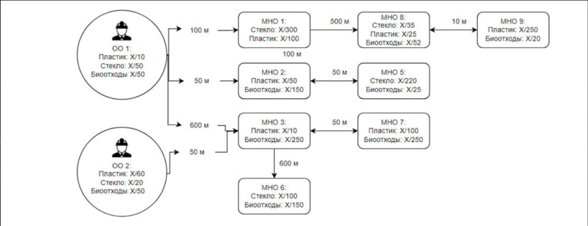

# Тестовое задание 1 (backend)

## Задача
Необходимо разработать API для системы учета отходов атом эко, включающего две основных сущности:

1. **Организация** (ОО) — сущность, генерирующая различные отходы.
2. **Хранилище** (МНО) — место, где происходит накопление и сортировка отходов.

## При реализации необходимо учитывать следующие требования:
1. **Хранилище** может принимать и хранить только те виды отходов, для которых оно специально оборудовано. При этом их может быть несколько:
   - биоотходы
   - стекло
   - пластик
2. **Организация** может генерировать разные виды отходов:
   - биоотходы
   - стекло
   - пластик
3. Максимальный запас на каждом **Хранилище** ограничен на уровне вида отхода. При достижении максимального запаса, **Хранилище** более не принимает отходы.
4. Каждой **Организации** доступна информация о расстоянии и оставшемся запасе любого **Хранилища**.
5. Все отходы **Организаций** должны быть переработаны (если есть доступное ***Хранилище**)
6. При передаче отходов необходимо выбирать ближайшее ***Хранилище**

## Технические требования

- Для реализации использовать **Django REST Framework (DRF)** или **Fast API**
- Описать инструкцию по запуску (деплою) решения
- Решение должно быть размещено в публичном репозитории на Github
---

### Будет плюсом, если:
- приложение запускается через docker-compose
- создан скрипт для создания тестовых данных
- реализованы unit-тесты основных методов API

Не забудь поделиться с нами ссылкой на репозиторий. Удачи! 😊