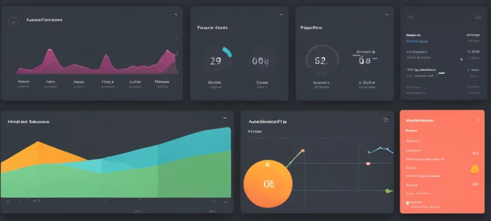

# Тестовое задание 4 (frontend)
 
## Задача
Создание приложения "атом борд".
Необходимо создать дашборд с аналитикой, который будет отображать различные графики, предоставляя пользователю возможность фильтровать данные по различным периодам.

## При реализации необходимо учитывать следующие требования:

1. Необходимо реализовать как минимум 3 типа графиков:
- Линейный график (Line Chart)
- Столбчатый график (Bar Chart)
- Круговая диаграмма (Pie Chart)

2. Каждый график должен отображать данные в зависимости от выбранного временного периода (за день, неделю, месяц).
3. Реализовать адаптивную верстку: при изменении размеров экрана элементы должны плавно перестраиваться, а графики масштабироваться для правильного отображения.
4. Реализовать возможность ручного ввода данных

## Технические требования
- Приложение должно быть выполнено с использованием Angular, а данные — визуализированы с помощью библиотек для построения графиков, таких как ng2-charts.
- Загрузка данных будет реализована через сервис, который возвращает статичные данные, имитируя работу с бэкэнд.
- Использовать TypeScript
- Следовать Angular Style Guide
- Использовать Angular компоненты для разбиения приложения на логические части.
- Реализовать сервис для управления состоянием игры:
- Описать инструкцию по запуску (деплою) решения
- Решение должно быть размещено в публичном репозитории на Github
---

### Будет плюсом, если:
- Реализована возможность сохранять выбранный пользователем временной период в sessionStorage или localStorage, чтобы при перезагрузке страницы сохранялся выбранный фильтр.
- Интерфейс корректно отображаться на экранах разных размеров:
    - ПК
    - Планшет
    - Смартфон
- Использованы CSS препроцессоры (SCSS/SASS)
- Применены принципы SOLID
- Приложение покрыто unit-тестами (хотя бы для одного компонента/сервиса)

Не забудь поделиться с нами ссылкой на репозиторий. Удачи! 😊